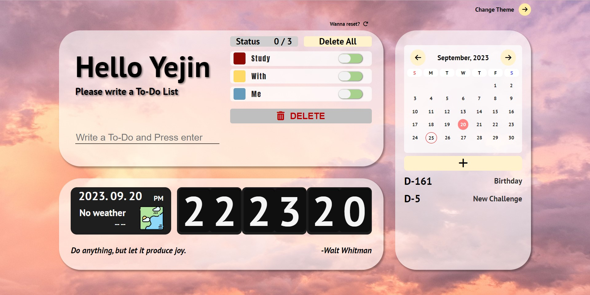

# Todo-Todo
-------------
ToDo-List, 실시간 시계, 위치기반 날씨정보, D-Day 달력 기능을 가진 Todo 관리 웹페이지입니다.  
https://wonyj0228.github.io/TodoTodo/ <-- 프로젝트 링크!

### 🖥️ 프로젝트 소개
-------------
구글 확장프로그램 momentum을 클론 코딩하는 노마드코더 '바닐라 JS로 크롬앱 만들기' 강좌를 수강한 뒤,   
개인 프로젝트로 만든 Todo 관리 웹 페이지입니다.   
Local Storage를 사용해 데이터를 save/load 하는 방식으로 구현 되었습니다.  
위치기반 날씨정보는 Geolocation API와 Open-Weather API를 사용해 구현했습니다.

### 🕰️개발 기간
-------------
#### 학습 기간 : 2023.09.04~ 2023.09.08 (5일)
#### 개발 기간 : 2023.09.11~2023.09.18 (8일)

### 🎪 프리뷰
-------------

### ⚙️ 개발 환경
-------------
- IDE : 
- Stack :   
- SCM : 

### 📌 주요 기능
-------------
| # | Main Category | Function | Detail |
|:---:|:----------:|--------------|---------------|
| 0 | Background  | 랜덤 배경 이미지   | - 웹 오픈시 랜덤으로 배경이미지 세팅.   - 우측 상단 버튼 사용해 이미지 변경 가능.       |
| 1 | Main Box  | UserName 저장   | - 저장된 UserName이 있을 경우 UserName을 Load해서 데이터가 입력된 화면 Display.       |
| 2 |               | ToDo 입력, 저장, 불러오기         | - ToDo 작성 후 엔터 시 데이터 Local Storage에 저장.   (저장내용 : todo id, 입력한 Todo 내용, 완료여부)       |
| 3 |               | ToDo 삭제 / 생성 모드 converting         | - Delete 버튼 클릭 시 토글이 사라지고 삭제 모드로 convert.   - 버튼 내용 Go Back으로 변경되고 Go Back 버튼 클릭 시 개별 삭제 아이콘 사라지고 토글 생성하여 생성모드로 convert|
| 4 |               | ToDo 개별 삭제, 일괄삭제         | - Delete 버튼 클릭해 삭제모드에서 ToDo 각 아이템에 위치한 삭제 아이콘 클릭 시 개별 삭제   - 상단 Delete All 버튼 클릭 시 입력된 모든 ToDo 일괄 삭제       |
| 5 |               | 완료 토글        | - toggle 클릭 시 해당 todo 완료로 text line through, background color 변경.   - 토글 재클릭하여 완료를 미완료 상태로 변경 가능.   - 페이지 재접속시 저장된 완료/미완료 상태에 따라서 display 가능      |
| 6 |               | 초기화         | - Main Box 위 초기화 버튼 클릭 시 저장된 UserName과 ToDo 모두 reset.      |
| 7 | Bottom Box | 초단위 시계         | - 초단위로 업데이트 되는 시계. setInteval 사용.      |
| 8 |               | 오늘 날짜         | - Date 객체 사용해 yyyy.MM.dd 포맷으로 오늘 날짜 display      |
| 9 |               | 날씨         | - Geolocation API, Open-Weather API를 사용해 사용자 위치에 따른 날씨 데이터 제공.   - API KEY .gitignore로 인해 배포된 버전에선 사용 불가능|
| 10 |               | 랜덤 명언         | - 웹 오픈시 랜덤으로 quote & author display      |
| 11 | Side Box     | 달력         | - today 기준으로 달력 초기 세팅. 상단 좌우에 위치한 버튼으로 월단위 이동 가능    - 저장된 D-Day 날짜가 display 중인 월에 있을 경우 빨간 원으로 d-day 표기     |
| 12 |               | D-DAY 생성 / 삭제        | - 달력 하단 + 버튼 클릭 시 d-day 입력하는 박스 display. d-day 내용과 날짜 입력시 저장   - 저장된 날짜에 맞춰 d-day 계산해 하단에 display   - display된 d-day 더블클릭 시 삭제 가능     |
| 13 |               | D-DAY Display         | - display 된 d-day 클릭시 달력이 해당 d-day가 위치한 월로 변경됨       |
